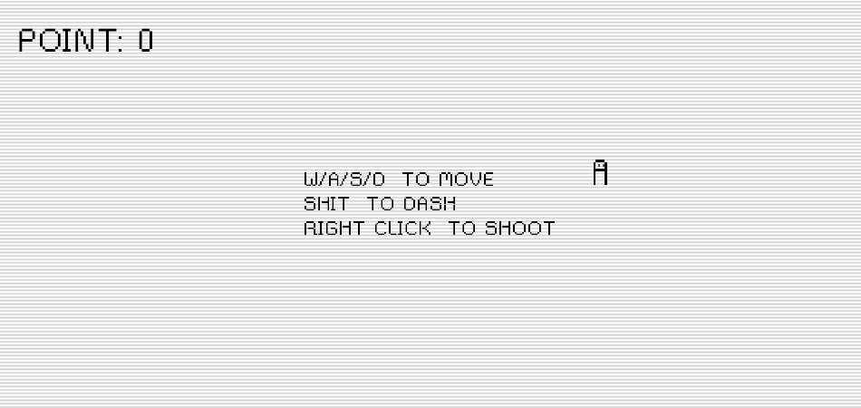

# 1 Week, 1 Project!

I try my best for making a small project every week. These projects aren't in specific field and I do it just for fun! Feel free to participate and pull requests are welcome!

<!-- **Projects Menu**
- [Numicide]() -->

- [WEEK 1 - Numicide]() - *Very simple game made with **Kaplay** - library for making web games.*

  

  * *How to run:*

  ```bash
  git clone https://github.com/sina-yeganeh/1week-1project.git
  cd ./1week-1project/numicide

  # npm and nodejs required
  npm install
  npm run dev
  ```
